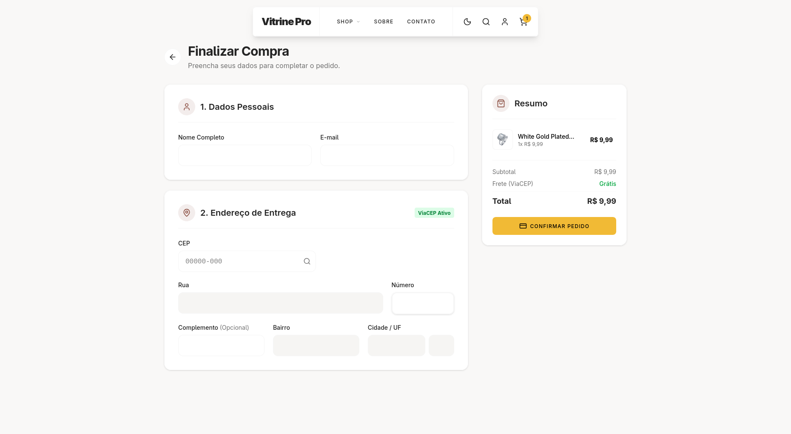

<h1 align="center">🛒 Vitrine Pro</h1>

<p align="center">
  E-commerce simulado com foco em performance, SEO e experiência do usuário — construído com Next.js 16, React 19 e Tailwind CSS v4.
</p>

<p align="center">
  
  
  
  
</p>

<p align="center">
  <a href="https://github.com/Alexandre-Mir/vitrine-pro">
    
  </a>
  <a href="https://vitrine-pro.vercel.app">
    
  </a>
</p>

---

## 📸 Preview




---

## 📌 Sobre o Projeto

O **Vitrine Pro** é uma loja virtual completa e funcional, construída como projeto de portfólio para demonstrar domínio prático em **arquitetura frontend moderna**, **otimização de performance** e **boas práticas de desenvolvimento**.

Vai além de um clone visual: o projeto resolve problemas reais de e-commerce como cache inteligente com ISR, validação de integridade de dados, navegação acessível e formulários otimizados para conversão.

### O que esse projeto demonstra

- Domínio do **App Router** do Next.js (RSC, Server Actions, layouts aninhados)
- Estratégias avançadas de **cache e revalidação** (ISR, `revalidate`)
- Componentização resiliente com **Error Boundaries** e fallbacks graceful
- Gerenciamento de estado global com **Context API** + persistência em `localStorage`
- Integração com APIs externas (FakeStoreAPI, ViaCEP)
- Acessibilidade, SEO técnico e Core Web Vitals otimizados

---

## ⚙️ Funcionalidades

### Vitrine & Catálogo
- Renderização híbrida com **SSR + ISR** — TTFB otimizado para SEO, cache de 1h para window shoppers
- Busca em tempo real processada no servidor (**Server Actions**) com debounce e controle de race conditions
- Estado da busca sincronizado com a URL (`searchParams` como SSoT) para compartilhamento e navegação
- **Mega Menu** com transição dinâmica via `ResizeObserver`, alternando entre busca, categorias e carrinho

### Carrinho de Compras
- Estado global via **Context API** com persistência em `localStorage` (escrita com debounce)
- Validação "double-check" de preços: no **add to cart** (unitário) e no **checkout** (batch) via Server Actions
- Botão Add to Cart com animação **CSS Grid** (`0fr → 1fr`) no hover
- Animações de lista com `@formkit/auto-animate`

### Checkout
- Autopreenchimento de endereço via **ViaCEP API** com foco automático no campo "Número"
- Validação em lote dos itens do carrinho antes de prosseguir

### Páginas Institucionais
- **Sobre** e **Contato** com formulário inteligente que sugere respostas do FAQ em tempo real (ticket deflection)

### Resiliência & Performance
- **FallbackImage**: componente que substitui imagens quebradas (404) por skeleton, sem quebrar o layout
- **Error Boundaries** estratégicos: graceful degradation no layout raiz, fail-fast nas rotas folha
- **Zero CLS**: placeholders dimensionados no servidor para componentes como o Theme Toggle

---

## 🛠️ Tecnologias

| Tecnologia | Uso |
|:---|:---|
| **Next.js 16** | Framework fullstack — App Router, RSC, Server Actions |
| **React 19** | Biblioteca de UI com React Compiler habilitado |
| **TypeScript** | Tipagem estática em todo o projeto |
| **Tailwind CSS v4** | Estilização utilitária com design responsivo |
| **Context API** | Gerenciamento de estado global (carrinho) |
| **FakeStoreAPI** | API externa simulando catálogo de produtos |
| **ViaCEP API** | Autopreenchimento de endereço por CEP |
| **Lucide React** | Biblioteca de ícones |
| **Auto-Animate** | Animações automáticas em listas |
| **Sonner** | Notificações toast |

---

## 📂 Estrutura do Projeto

```
src/
├── app/
│   ├── actions/          # Server Actions (busca, validação de carrinho)
│   ├── components/       # Componentes globais (Header, MegaMenu, CartPanel...)
│   ├── providers/        # Context Providers (tema, carrinho)
│   ├── checkout/         # Rota de checkout
│   ├── contato/          # Formulário de contato com ticket deflection
│   ├── sobre/            # Página institucional
│   ├── perfil/           # Página de perfil
│   ├── products/         # Rota dinâmica de produto ([id])
│   ├── categorias/       # Navegação por categorias
│   └── search/           # Página de resultados de busca
├── context/              # Context API (CartContext)
├── hooks/                # Custom hooks (useDebounce, useScrollDirection...)
├── services/             # Camada de acesso a dados (fetch wrappers)
├── types/                # Interfaces TypeScript
└── utils/                # Utilitários (formatação monetária, constantes)
```

---

## 🚀 Como Executar

### Pré-requisitos

- **Node.js** 18+ 
- **Git**

### Instalação

```bash
# Clone o repositório
git clone https://github.com/Alexandre-Mir/vitrine-pro.git

# Acesse a pasta
cd vitrine-pro

# Instale as dependências
npm install

# Inicie o servidor de desenvolvimento
npm run dev
```

Acesse [http://localhost:3000](http://localhost:3000) no navegador.

---

## 📅 Roadmap

- [x] Carrinho de compras com persistência e validação
- [x] Busca em tempo real com Server Actions
- [x] Checkout com autopreenchimento via ViaCEP
- [x] Páginas institucionais (Sobre, Contato)
- [x] Mega Menu com transições dinâmicas
- [ ] Filtros avançados (preço, ordenação, avaliação)
- [ ] Refatoração responsiva do menu de categorias

---

## 👤 Autor

**Alexandre Mir**

[](https://github.com/Alexandre-Mir)

---

## 📄 Licença

Este projeto é de uso pessoal para fins de portfólio e aprendizado.
